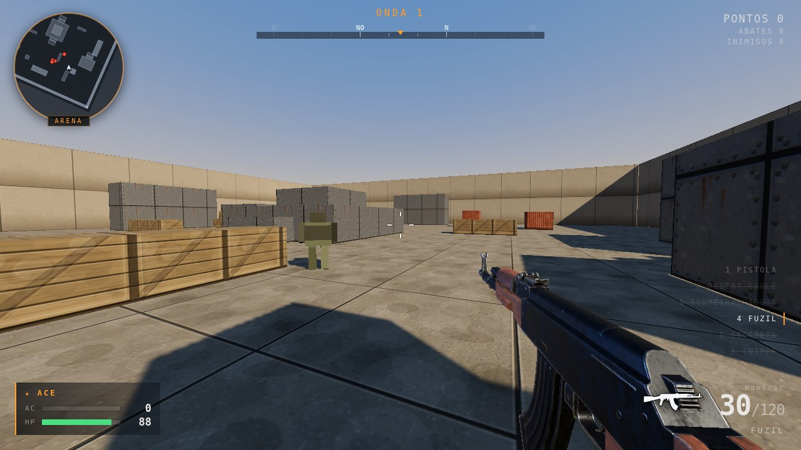

# RPK.FPS

FPS de arena que roda no navegador. Sem engine de jogo, sem instalação, sem
conta: abre a página e joga. Feito em **TypeScript + Three.js + Vite**, tudo
escrito à mão.

[](https://github.com/okaiquemota/rpk.fps/actions/workflows/pages.yml)

### ▶ [Jogar agora](https://okaiquemota.github.io/rpk.fps/)

[](https://okaiquemota.github.io/rpk.fps/)

Três modos: aguentar ondas de inimigos, trocar tiro com soldados que atiram de
volta, ou treinar no campo de tiro. Seis armas, com padrão de recuo
determinístico — dá pra decorar o desenho de cada uma e compensar puxando o
mouse ao contrário.

Quase tudo é gerado por código: as texturas são desenhadas em canvas 2D, o som é
sintetizado em WebAudio e a geometria do mundo é `BoxGeometry`. Os únicos
arquivos de arte são os seis `.glb` das armas e duas gravações de tiro — e mesmo
esses são **opcionais**: faltando o arquivo, a arma cai no modelo procedural e o
som volta pro sintetizado.

## Rodando

```bash
npm install
npm run dev      # http://localhost:5173
```

| Comando | O que faz |
|---|---|
| `npm run dev` | servidor de desenvolvimento |
| `npm run build` | typecheck + bundle de produção em `dist/` |
| `npm run build:single` | `dist/rpk-fps.html` — o jogo inteiro num arquivo só |
| `npm run preview` | serve o `dist/` (útil pra testar o build) |
| `npm run typecheck` | só o `tsc`, sem gerar nada |
| `npm run assets` | quanto pesa cada asset, nos dois formatos de build |

**São duas saídas diferentes, e a diferença importa.** `build` gera a pasta
`dist/` com os assets como arquivos separados — é isso que o GitHub Pages
publica. `build:single` embute tudo em base64 num HTML só, pra baixar e jogar
offline com duplo clique; é um extra, não o deploy.

## Controles

| Tecla | Ação |
|---|---|
| `W` `A` `S` `D` | Mover |
| `Shift` | Correr (só pra frente) |
| `Espaço` | Pular |
| `Ctrl` / `C` | Agachar |
| Botão esquerdo | Atirar |
| Botão direito | Mirar (ADS) |
| `R` | Recarregar |
| `1` a `6` / scroll | Trocar de arma |
| Setas | Olhar (alternativa ao mouse) |
| `F` | Tela cheia |
| `F3` | Painel de diagnóstico (fps, desenhos, renderizador) |
| `L` | Limpar a parede de padrão (só no campo de tiro) |
| `Esc` | Pausar |

O menu de pausa tem sensibilidade, campo de visão, volume e escala de resolução.

### Sobre a captura do mouse

Um FPS precisa capturar o cursor (pointer lock) para a mira funcionar direito.
O jogo pede isso ao começar, junto com tela cheia, e **continua tentando a cada
clique** — o navegador recusa a captura em situações passageiras (logo depois de
você sair de um lock com Esc, por exemplo), e desistir na primeira recusa
condenava a partida inteira.

Enquanto a captura não vem, entra o modo de mira solta: o mouse continua girando
a câmera, e empurrá-lo contra a borda da tela mantém o giro, para você dar a
volta completa sem o cursor esbarrar na moldura. Esse giro só age com o mouse em
movimento — largar o cursor na borda não faz a tela girar sozinha — e pode ser
desligado no menu de pausa.

**Uma página dentro de um iframe pode ter a captura bloqueada por política do
navegador, e aí não há o que o jogo faça.** Nesse caso, rode-o fora do iframe:
`npm run dev`, ou `npm run build:single` e abra o `dist/rpk-fps.html` direto no
navegador. Tela cheia (`F`) também ajuda bastante, porque a área para girar o
mouse passa a ser o monitor inteiro.

## Modos

- **Sobrevivência** — ondas de inimigos, melhorias entre elas, o jogo em si.
  Você morreu, acabou.
- **Confronto** — tiroteio contra soldados armados, cinco em campo o tempo
  todo. Não há ondas nem escalada de vida: a dificuldade é que eles atiram de
  volta. **Morrer não encerra a partida** — você volta no ponto mais longe de
  quem está vivo. Quem termina é o placar (25 abates) ou o relógio (5 min), e
  todas as armas já entram liberadas.
- **Campo de tiro** — sem inimigos, seis armas liberadas e munição infinita.
  Serve pra sentir recuo e som, e pra comparar armas com número em vez de
  impressão: uma parede clara registra os impactos e o painel mostra o
  **agrupamento** (raio médio dos furos em torno do centro deles). `L` limpa a
  parede pra repetir o teste. Há marcos no chão a 10, 20 e 30 m, e cinco alvos
  que caem e levantam — três parados a distâncias diferentes e dois em
  movimento, pra treinar acompanhamento.

## Como o jogo funciona

- **Ondas.** Cada onda traz mais inimigos, com mais vida e mais rápidos. Tipos
  novos entram conforme as ondas avançam: capanga (onda 1), corredor (2),
  atirador (3), brutamontes (5, e em toda onda múltipla de 5).
- **Temperos de onda.** Cerca de uma onda em cada três vem com um modificador:
  *horda* (muitos corredores fracos), *elite* (poucos, duros, valem mais) ou
  *cerco* (atiradores por toda parte). Aparece no HUD ao lado do número da onda.
- **Melhorias.** Toda onda limpa abre uma escolha entre três cartas, de um baralho
  de onze — dano, cadência, recarga, carregador, dispersão, velocidade, vida,
  roubo de vida, colete por onda, dano em headshot e munição por abate. Elas
  acumulam (cada uma com um teto próprio) e valem pela partida inteira; a tela
  final mostra o que você montou.
- **Armas.** Seis, e cada uma aparece como item na arena numa onda:
  pistola (desde o início), fuzil (2), submetralhadora (3), escopeta (4),
  Desert Eagle (6) e sniper (8). A sniper tem luneta de verdade — mirar troca a
  tela pela mira telescópica, e sem mirar ela é quase inútil, de propósito.
  Quem manda na hora de aparecer é o campo `unlockWave` de cada arma.
- **Vida.** Regenera até 50 depois de 6 segundos sem tomar dano. Passar de 50
  exige kit de vida — que os inimigos dropam e que aparece entre as ondas.
- **Pontos.** Cada abate vale os pontos do tipo × um multiplicador de combo que
  sobe a cada morte seguida (até 10×) e zera se você passar 4 segundos sem matar
  ninguém. Headshot vale 50 extras; limpar a onda N vale N × 100.
- O recorde fica salvo no `localStorage`.

## Arquitetura

```
src/
  config.ts             todos os números de tuning num lugar só
  main.ts               bootstrap: renderer, modelos e Game, nessa ordem
  core/
    Game.ts             loop principal; conecta todos os sistemas
    Input.ts            teclado, mouse e pointer lock
    Audio.ts            engine de som procedural (WebAudio)
    ShotSamples.ts      gravações de tiro opcionais, achadas por glob
    gltf.ts             carregador de .glb (meshopt, Draco, KTX2)
    gpu.ts              detecta renderização por software e adapta
    math.ts             AABB, raycast, lerp/damp, aleatórios
  world/
    Level.ts            arena: geometria + colisores + spawns + luzes + céu
    Physics.ts          movimento de personagem com colisão AABB
    Pickups.ts          itens no chão
    textures.ts         texturas em canvas, com normal e roughness derivados
  player/
    Player.ts           movimento, câmera, vida, arsenal
    Stats.ts            as melhorias e os multiplicadores que elas mexem
  weapons/
    WeaponDefs.ts       stats das armas
    Weapon.ts           munição, cadência, recarga, dispersão
    Combat.ts           hitscan: quem foi atingido e por quanto
    ViewModel.ts        a arma na tela (bob, sway, recuo, recarga)
    WeaponModels.ts     carrega os .glb e os entrega prontos ao ViewModel
    WeaponAnimator.ts   toca os clipes que vêm dentro do modelo
  enemies/
    EnemyTypes.ts       stats dos inimigos
    Enemy.ts            IA, animação e estado de um inimigo
    EnemyManager.ts     ondas, spawn e resolução de ataques
    Projectile.ts       projéteis dos atiradores
  modes/
    ShootingRange.ts    campo de tiro: alvos, parede de padrão, agrupamento
  fx/Effects.ts         tracers, impactos, sangue, decals, cápsulas, shake
  ui/
    HUD.ts              HUD em DOM
    Screens.ts          menus, opções e persistência
    Minimap.ts          minimapa em canvas
    Compass.ts          bússola em canvas
    WorldMarkers.ts     número de dano e vida do inimigo, em DOM
    PerfMeter.ts        o painel do F3
    weaponIcons.ts      silhuetas das armas, traçadas dos próprios modelos
    style.css
```

## Decisões que valem explicar

- **Tudo colide como AABB.** Sem engine de física. `moveCharacter` resolve um
  eixo por vez, o que dá deslizamento em parede e subida de degrau de graça.
- **A geometria visual e a de colisão saem da mesma lista de blocos** em
  `Level.buildProps()`. É impossível o mundo desenhado divergir do que colide.
- **O tiro sai do olho, não do cano.** O raycast parte do centro da tela; o
  tracer é que sai da boca da arma. É o que todo FPS faz, e é o que faz a mira
  parecer honesta.
- **A arma é renderizada numa cena separada**, com câmera e FOV próprios, por
  cima do mundo com o depth buffer limpo. Sem isso ela atravessa parede.
- **As melhorias são multiplicadores num só objeto** (`Stats`), que as armas e o
  jogador consultam. Uma melhoria nova não toca no balanceamento, e o
  balanceamento não precisa saber que melhorias existem.
- **O relevo e a rugosidade das superfícies saem do próprio albedo**, separados
  por frequência: detalhe fino (junta, nervura, rebite) vira normal map, mancha
  larga (óleo, ferrugem escorrida) vira roughness. Nada é desenhado duas vezes.
- **Um sol só, e o céu como environment map.** `SUN_DIR` é a única fonte da
  direção: a luz direcional, o disco no céu e os reflexos leem do mesmo vetor.
  Separados, o céu mostrava o sol num canto e a sombra caía pro outro.
- **Cada tiro são quatro camadas** — estalo, corpo, grave e ferrolho — passando
  por saturação e por um reverb de convolução com resposta de impulso gerada em
  código. É o que separa "bip" de tiro. Havendo gravação em `assets/sounds/`,
  ela entra no lugar das camadas, pelo mesmo caminho de espacialização.
- **O padrão de recuo é determinístico**, não aleatório: dá para decorar o
  desenho de cada arma e compensar puxando o mouse ao contrário. E o recuo é um
  offset somado à mira, nunca uma alteração do `pitch`/`yaw` do jogador — por
  isso ele volta sozinho quando a rajada acaba.
- **Som do mundo é posicional.** Tiro de inimigo, passo, morte e impacto passam
  por um `PannerNode` e chegam do lado certo; o que é seu (tiro, recarga, seus
  passos) vai direto pro master.
- **Pools pré-alocados em tudo que é efeito.** Um tiro de escopeta gera 9
  impactos no mesmo frame; alocar nesse momento é engasgo de GC na hora errada.
- **A quantidade de luzes da cena nunca muda depois que o jogo carrega**, e os
  shaders são todos compilados na tela inicial. Os dois detalhes existem pelo
  mesmo motivo: no three, qualquer um deles fora de hora trava o frame.
- **Os ícones das armas no HUD são traçados dos próprios `.glb`**, não
  desenhados no olho — o que vai no bundle são coordenadas, então o ícone
  continua existindo sem os modelos.

Durante o jogo, `window.__RPK` expõe a instância do `Game` — dá pra bisbilhotar
`__RPK.player`, `__RPK.enemies.enemies`, etc. no console do navegador.

## Publicando

O repositório já traz um workflow de GitHub Pages
(`.github/workflows/pages.yml`), e o jogo está no ar em
[okaiquemota.github.io/rpk.fps](https://okaiquemota.github.io/rpk.fps/).

Para ligar num fork:

1. **Settings → Pages → Source: "GitHub Actions"**
   Não escolha *"Deploy from a branch"*: nesse modo o GitHub serve os arquivos
   do repositório como estão, e o `index.html` da raiz é o arquivo fonte — ele
   aponta para `/src/main.ts`, que o navegador não sabe executar. O resultado é
   uma página crua, sem estilo e sem jogo. (Se isso acontecer, a própria página
   avisa e diz o que corrigir.)
2. Faça push na branch de publicação (ou rode o workflow à mão pela aba
   **Actions**)
3. O jogo sai em `https://<usuario>.github.io/rpk.fps/`

Servido assim, a página fica no topo do navegador — sem iframe no caminho — e a
captura do mouse funciona normalmente. É a diferença entre jogar com mira de FPS
de verdade e jogar no modo de mira solta.

## Desempenho

O jogo não é pesado de geometria: algumas dezenas de desenhos e uns 4 mil
triângulos por quadro. Se o fps estiver ruim, **a primeira coisa a checar é o
`F3`** — ele mostra o nome do renderizador e acende em vermelho quando o
navegador caiu pra renderização por software (SwiftShader, llvmpipe, WARP).
Nesse estado cada pixel sai da CPU, e ligar a aceleração por hardware no
navegador resolve o que nenhuma otimização resolveria. Detectado o caso, o jogo
já nasce adaptado: resolução em 50% e sem antialiasing.

Fora isso, o custo é **por pixel**, não por objeto: a escala de resolução no
menu de pausa é a alavanca mais forte, porque o custo do quadro cresce com a
área.

## Créditos

**Fuzil: "Ak47", por wburton** — [CC BY 4.0](https://creativecommons.org/licenses/by/4.0/),
via [Sketchfab](https://sketchfab.com/3d-models/ak47-831519a097d84e079fd8bc4b15e5b57d).
Alterado para o espaço do viewmodel (escala, orientação, enquadramento).
Esta licença **exige** atribuição — o crédito também aparece na tela inicial do
jogo.

**Outras cinco armas: Ultimate Guns Pack, por Quaternius**, via
[Poly Pizza](https://poly.pizza) — CC0.

Detalhes e o resto em [`CREDITS.md`](CREDITS.md). Bibliotecas: three.js, Vite e
TypeScript.

## Ideias pro próximo fim de semana

Coisas que o código já está preparado pra receber:

- [ ] Mais mapas (`Level` já é uma lista de blocos — dá pra ter várias)
- [ ] Mais armas (entrada em `WEAPON_DEFS` + um rig no `ViewModel`)
- [ ] Granadas / dano em área
- [ ] Inimigo que voa ou que explode ao morrer
- [ ] Melhorias raras/lendárias, e melhorias que mudam como a arma funciona
- [ ] Chefe a cada dez ondas
- [ ] Placar online
- [ ] Suporte a gamepad
- [ ] Calibrar o enquadramento das outras cinco armas (só o fuzil está feito)
